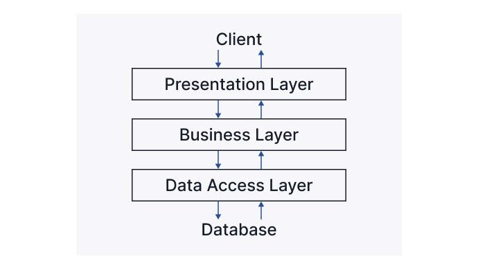
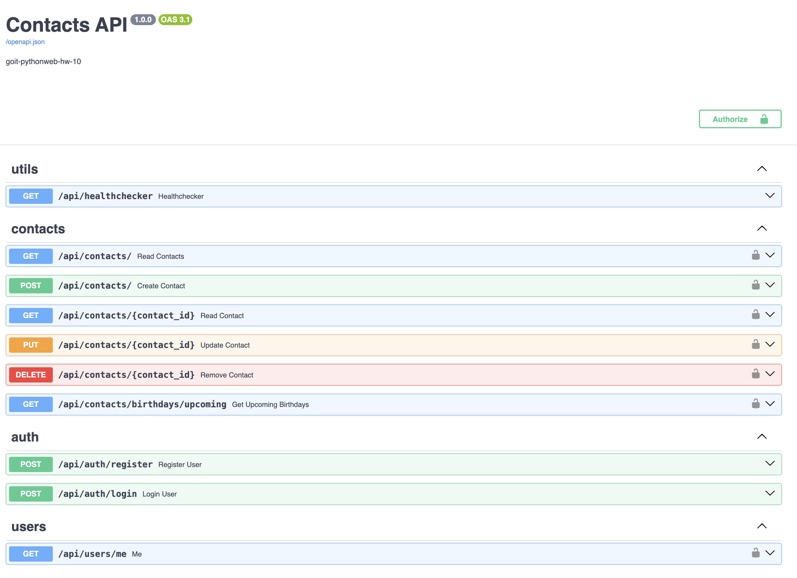

# goit-pythonweb-hw-08

В даному проекті реалізовано REST API додаток з використанням багаторівневої
архітектури 

## Стек

- Python 3.11
- FastAPI
- PostgreSQL
- ORM SQLAlchemy
- Alembic
- Swagger
- Pydantic
- Docker
- Poetry

## Технічнe завдання

1. Контакти

Для зберігання контактів вашої системи необхідно організувати базу даних, яка
буде містити всю необхідну інформацію.

Ця інформація повинна включати:

- Ім'я
- Прізвище
- Електронна адреса
- Номер телефону
- День народження
- Додаткові дані (необов'язково)

2. API

API, яке ви розробляєте, повинно підтримувати базові операції з даними. Нижче
наведено список дій, які ваш API повинен мати можливість виконувати:

- Створити новий контакт
- Отримати список всіх контактів
- Отримати один контакт за ідентифікатором
- Оновити контакт, що існує
- Видалити контакт

3. CRUD API

На придачу до базового функціоналу CRUD API також повинен мати наступні функції:

- Контакти повинні бути доступні для пошуку за іменем, прізвищем чи адресою
  електронної пошти (Query параметри).
- API повинен мати змогу отримати список контактів з днями народження на
  найближчі 7 днів.

## Інсталяція та запуск

1. Склонуйте репозиторій

2. Перейдіть в директорію проекта

```
cd goit-pythonweb-hw-08
```

3. Використайте Docker Compose для побудови і запуску середовища.

```
docker-compose up --build
```

4. Веб-додаток працює на порту 8000:

Swagger: http://localhost:8000/docs


